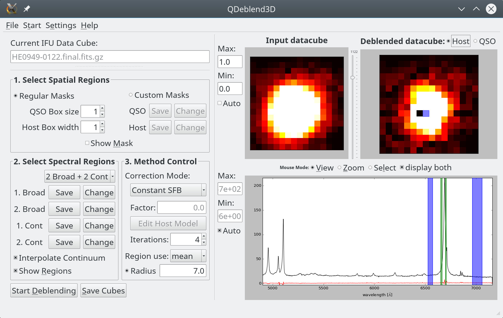

# QDeblend3D
## Scope 
QDeblend3D is a graphical user interface (GUI) to visualize 3D data cubes delivered by optical/NIR integral-field
spectrograph from astronomical observations stored in FITS data format. It is particularly designed to re-construct
the point-spread function directly from broad emission lines of unobscured Active Galactic Nuclei (AGN). It thereby
allows to iteratively remove the spectral and spatial contribution of the AGN across the entire field-of-view. The
GUI allows to review and optimize the settings to improve the results. QDeblend3D has therefore a very targeted scope
and limited in its capabilites.

## Installation instructions
Important note: QDelbend3D was developed several years ago and is still running with python 2 and Qt4. Porting to modern 
Qt5 with python 3 is not straight forward and time consuming. A new release is in the plan but timescales are uncertain.
Hence, particular care needs to be taken for the dependencies. We strongly recommend to use a conda or other dedicated
python environment system to create the right environment to run QDeblend3D. The steps are the following:

1. download QDeblend3D from github.com/brandherd/QDeblend3d
2. create a dedicated conda environmet by calling `source QDeblend_conda.sh`
3. change the environment with `conda activate QDeb`
4. run `pip install .` or `python setup.py install` to install QDeblend3D into the environment
5. change into the example directory and call `QDeblend3D HE0949-0122.final.fits.gz 
   
QDeblend3D is sucessfully installed when the GUI opens.

## Usage and Manual
Usage of QDeblend3D as a visualization tool of 3D spectroscopic data should be intuitive and straight forward. 
The process to perform the more complicated task of removing the AGN contribution from the data requires a bit more 
experience. The user is referred to the pdf manual in the docs directory or the online manual available in QDeblend3d
in the Help - Online Manual menu.

